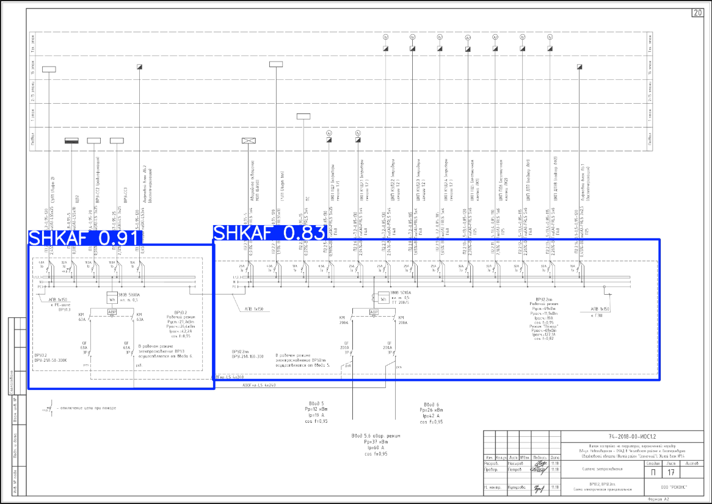

# Система автоматического распознавания элементов электрической схемы и формирования сметы

## 1. ТЗ и введение  

В соответствии с техническим заданием (ТЗ) необходимо разработать алгоритм, который позволит автоматически производить анализ и 
детектирование элементов электрической схемы и формировать смету данной схемы, используя компоненты из 
номенклатурной базы. 

Пользователями (целевой аудиторией) данной системы являются сметчики, которые вручную составляют сметы проектов на производстве. 

Входными данными для алгоритма являются изображение схемы, для которой необходимо составить смету и база данных номенклатурных
наименований элементов. Изображение должно быть представлено в одном из следующих форматах: .png, .jpg, .pdf. База данных в формате .xlsx. 

Данная система формирования сметы состоит из четырех функциональных блоков: блок детектирования, распределения, расшифровки и блока формирования результата. 
Информация о каждом из них более подробно представлена в отдельных разделах ниже. Структурная схема алгоритма представлена ниже

 <p align="center">
 
</p>

## 2. Блок детектирования 

Блок детектирования условно состоит из 2-х нейронных сетей YOLO: одна используется для детектирования области шкафов на схеме, 
а другая для детектирования всех оставшихся элементов. Таким образом, данная система позволяет составлять сметы отдельно для каждого шкафа, присутствующего на изображении схемы. 
* использует **ultralytics YOLO**;
* модель детектирует различные классы элементов и их текстовых описаний на изображении;

### Датасет 
* Формат датасета должен соответствовать требуемому формату **YOLO** [[1]](https://docs.ultralytics.com/datasets/detect/);
* Для обучения изображения должны быть представлены в формате .jpg, для тестирования модели подойдут изображения в следующих форматах: .jpg, .pdf, .png. 
* Организация файлов должна соответствовать определенной структуре (представлена на рисунке ниже);

 <p align="center">
 
</p>

В каталоге `images` изображения распределяются на 3 подкаталога: `train`, `val`, `test`. Файлы в подкаталоги `train` и `val` лучше распределять 
в процентном соотношении 90 к 10, соответственно. В каталоге `labels` аналогичным образом распределяются .txt файлы аннотаций к данным изображениям. 
Если у вас имеется общий файл для нескольких изображений аннотаций формата **.xml**, то его нужно преобразовать в формат подходящий для **YOLO**. 
В данном проекте это можно сделать, используя файл `convert.py` в директории `data/convert.py` Файлы **.xml** должны быть помещены по пути `data/annotation_xml/`, результат 
преобразования сохраняется в каталоге `data/dataset/labels/train`.

> В данном алгоритме используется переразмеченный датасет. Класс `TEXT` был разбит на несколько, в зависимости от остальных элементов (т.е. классу `QF` соответствует
> текстовый класс `QF_TEXT`, классу `R` соответствует `R_TEXT` и т.д.), также разметили отдельный датасет для поиска области шкафов (в разметке присутствует только один класс).
> Примеры размеченных изображений двух датасетов представлены ниже.

 <p align="center">
 
</p>

<p align="center">
     
     
</p>

Результаты детектирования двух нейронных сетей **YOLO** накладываются друг на друга в итоговом изображении. Результат представлен ниже

 <p align="center">
 
</p>

### Обучение модели 

Предварительные модели можно загрузить с [[2]](https://docs.ultralytics.com/models/yolov8/#supported-tasks-and-modes). Преимущественно используется модель v8x, поскольку она обладает большим потенциалом 
для реализации данной задачи, ее обучение производится быстрее, чем у 10 версии, а показатель точности не меньше. Запуск обучения осуществляется с 
помощью скрипта `train.py`. Гиперпараметры, которые были использованы для обучения двух моделей **YOLO**, представлены ниже. 

```python
results = model.train( data="data.yaml", imgsz=640, epochs=1000, batch=6, workers=16,
device=0, amp=True, hsv_h=0, hsv_s=0, hsv_v=0.6, degrees=90, translate=0.15, scale=0.4,
flipud=0, fliplr=0.5, mosaic=0.7, mixup=0.2, auto_augment="augmix", erasing=0, crop_fraction=0.5)
```

При отсутствии изменений метрики score в течение 100 эпох обучение модели прекращается. Веса обученной модели были сохранены в директории `hackaton_interface/weights/`
Обучение модели выполнялось на Windows 10, … 

### Что можно сделать, чтобы повысить точность детектирования модели (точность работы первого блока)
* Сформировать корректный датасет, где будет отсутствовать дисбаланс классов, т.е. практически в равной степени будут присутствовать элементы разных классов;
* Добавить в набор данных для обучения разнообразные по конфигурации схемы;
* При разметке учитывать, чтобы текст текстовых боксов полностью попадал внутрь рамок.

### Результат выполнения данного блока: 
детектированные элементы на изображении, их координаты.

## 3. Блок распределения
* Сопоставление объектов с соответствующими им текстами/параметрами на схеме;
* Для сопоставления используется двухэтапный алгоритм.
  
Блок распределения связывает детектированные объекты по принципу: элемент – параметры элемента.

Пример пары связанных объектов: 

 <p align="center">
 
</p>

Связывание происходит по ключевым символам в названиях классов. Для реализации данного блока 
выполнялась переразметка датасета. Извлекался один объект конкретного класса, и рассчитывалось расстояние от 
данного объекта до группы текстовых боксов со схожим названием. В пару ставился текстовый бокс, у которого наименьшее расстояние до данного элемента.  
Также в данном блоке осуществляется связывание результатов детектирования области шкафов и элементов, чтобы можно было формировать смету отдельно 
для каждого шкафа, изображенного на схеме. Блок распределения представлен в `utilities.py` в функции `bind_text_boxes`. 

### Результат выполнения данного блока:  
сформированные пары элементов и их параметров, координаты. 

## 4. Блок расшифровки 
* Используется алгоритм **PaddleOCR** [[3]](https://github.com/PaddlePaddle/PaddleOCR); 
* Осуществляется распознавание текста на фрагментах изображения под разным углом (поворот текста на 90, 180, 270).

Результат выполнения данного блока: расшифрованный текст с фрагмента изображения. Пример: 
```yaml
WH: 380B,5A
TT:
QF: QF-4P MD63-3
TT:
TT: 380B,5A
SWITCH:
FV: QF-4P MD63-3
SWITCH:
SWITCH: MD630N 3P 630A 4B10901
SWITCH:
QFD: QF-4P MD63-3 25A
```
## 5. Блок формирования результатов
* Алгоритм поиска элементов в номенклатурной базе на основе расшифрованных параметров;
* Используются элементы ***fuzzy matching***;
* Калькуляция стоимости на основе алгоритма минимизации цены;
* Формирование сметы проекта в формате .xlsx

### Результат выполнения данного блока: 
смета проекта в формате .xlsx
